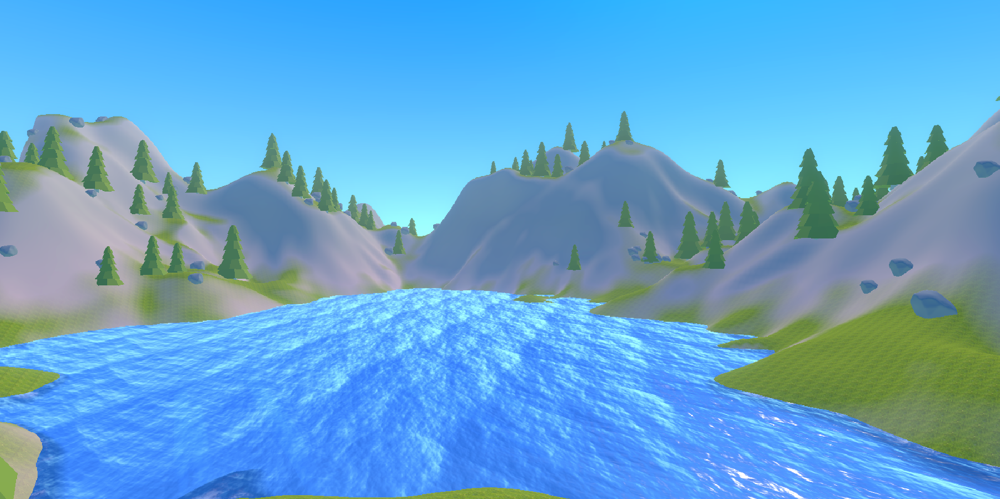
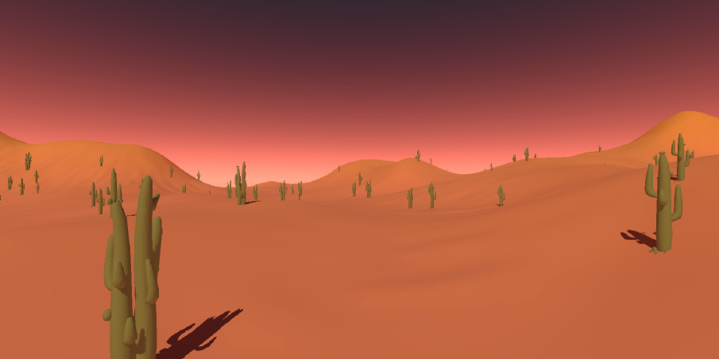
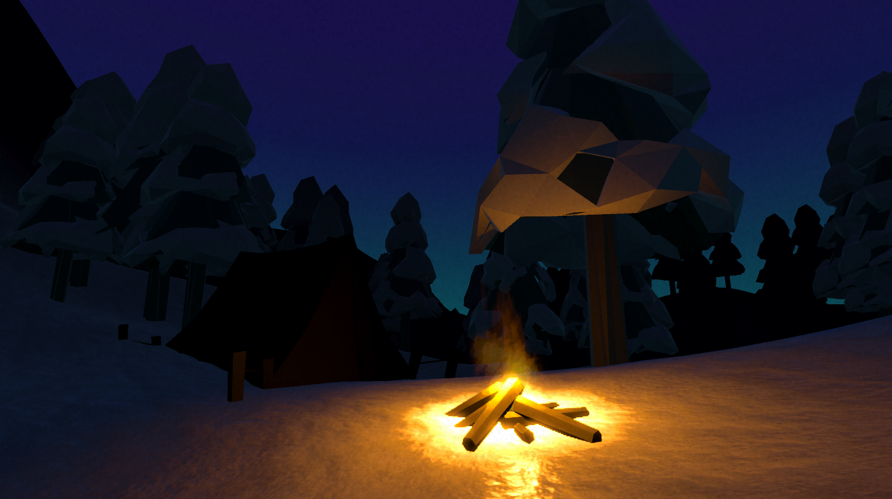
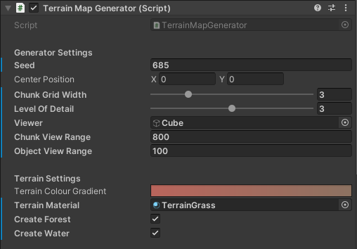
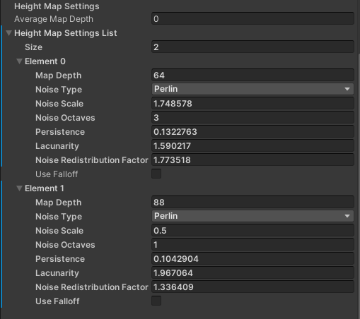
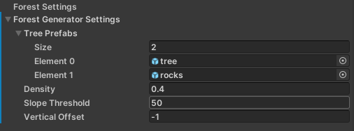
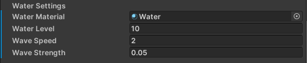
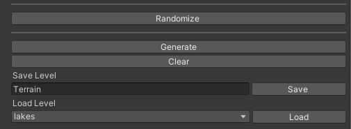

# Procedural Terrain Generator
This is a Procedural Terrain Generator for use in Unity projects. Using random noise algorithms, physics simulation, random object placement, custom materials, textures, and colours an endless variety of worlds can be created using this tool. This tool can create a terrain mesh, water mesh, and randomly place objects among a scene. The following images are scenes created based upon terrains created using this Procedural Terrain Generator.

## Getting Started
### Installing
1. Create a new empty Unity 3D project.
2. Clone into Unity project with `git clone https://github.com/aidan-clyens/TerrainGenerator.git` in the Assets folder.

### Setup Universal Render Pipeline (Optional but required to use sample materials and shaders)
1. Install the Universal Render Pipeline and ShaderGraph to use sample materials and shaders.
2. Create a new Universal Render Pipeline Asset with Depth Texture and Opaque Texture enabled (this is included under the "Settings" folder).
3. Go to Project Settings > Graphics and update the Scriptable Render Pipeline Settings.

### Generating Terrain
1. Add TerrainGenerator prefab into scene.
2. Configure settings and add terrain and water materials.
3. Click "Generate" to create terrain.
4. Randomize terrain settings by clicking "Randomize".
5. Save terrain by entering a name and clicking "Save".
6. Saved terrains can be loading by selecting a name and clicking "Load".

## Terrain Generator

### Height Map Settings

### Hydraulic Erosion Settings
**Note:*single chunks (i.e. Chunk Grid Width = 1)

### Procedural Object Settings

### Water Settings

### Generate/Save/Load

## Change Log
### v1.0
- Initial release.

### v1.1
- Fixed sample models imported from Blender.
- Added WaterManager script, which is attached to the Water mesh and used to synchronize waves produced using the sample Water shader. The WaterManager provides the time offset to the Water shader so that the same wave equation may be accessed by script.

### v1.2
- Add option to change terrain chunk width at powers of 2
- Add option to generate terrain chunks in a grid
- Add options for more non-uniform terrain generation
- Fix viewer for multi-chunk generation
- Add view range for terrain chunk objects as well as forest objects
- Remove "Normalize Local" option and just normalize all terrain chunks globally
- Add OpenSimplex noise as well as Perlin noise for terrain generation
- Add multiple layers of noise in Height Map Generator

### v1.2.1
- Edited README
- Do not allow chunk width of 0

### v1.3
- Run chunk generation in a separate thread to improve performance
- Add Level of Detail setting to terrain mesh
- Add Height Map Settings, Hydraulic Erosion Settings, Forest Settings, and Water Settings all to TerrainMapGenerator prefab
- Make all settings objects serializable
- **WARNING:** Previously saved Level files will not be compatible with v1.3 of the TerrainMapGenerator

## Credit
- Simplex Noise Generator provided by [jstanden](https://gist.github.com/jstanden/1489447)

## Author
Aidan Clyens
