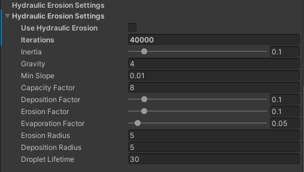

# Procedural Terrain Generator
This is a Procedural Terrain Generator for use in Unity projects. Using random noise algorithms, physics simulation, random object placement, custom materials, textures, and colours an endless variety of worlds can be created using this tool. This tool can create a terrain mesh, water mesh, and randomly place objects among a scene. The following images are scenes created based upon terrains created using this Procedural Terrain Generator.

## Getting Started
### Installing
1. Create a new empty Unity 3D project **(Note: Project must use the Universal Render Pipeline)**.
2. Clone into Unity project with `git clone git@github.com:aidan-clyens/TerrainGenerator.git`.

### Generating Terrain
1. Add TerrainGenerator prefab into scene.
2. Configure settings and click "Generate" to create terrain.
3. Save terrain by entering a name and clicking "Save".
4. Saved terrains can be loading by selecting a name and clicking "Load".

## Terrain Generator

## Height Map Generator

## Hydraulic Erosion

## Forest Generator

## Author
Aidan Clyens